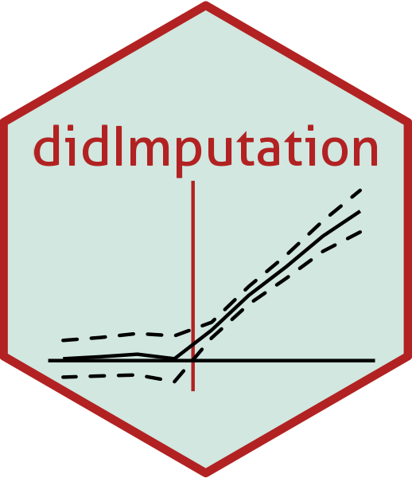
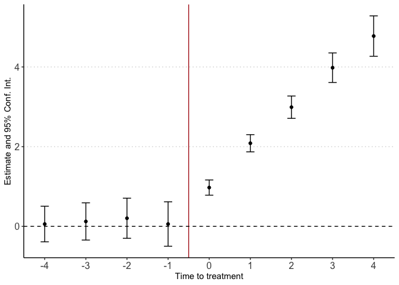

Did Imputation
================

<!-- README.md is generated from README.Rmd. Please edit that file -->



<!-- badges: start -->

[](https://github.com/CdfInnovLab/didimputation/actions)

[](https://codecov.io/gh/CdfInnovLab/didImputation?branch=master)

[](https://lifecycle.r-lib.org/articles/stages.html#experimental)

[](https://github.com/CdfInnovLab/didImputation)

[](https://github.com/CdfInnovLab/didImputation)

<!-- badges: end -->

Estimation of staggered Difference-in-Differences using the imputation
approach of Borusyak, Jaravel, and Spiess (2021). The packages allows
for:

-   Multiple time periods

-   Staggered design (i.e., units are treated at different time periods)

-   Continuous controls

The package implements an imputation method to estimate the treatment
effect and pre-trend testing in difference-in-differences designs with
staggered adoption (i.e where units are treated at different time
periods). Recent literature stress out the importance of not using the
standard *twoway fixed effect* regression.

The standard DiD setup involves two periods and two groups (one treated
and one untreated), it relies on parallel trend assumption to estimate
the treatment effect of the treated. The staggered DiD setup is the
generalization of this approach to multiple periods and multiple groups
(i.e. individuals treated at different time periods.). Recent literature
stress out the need to not use the standard two-way fixed effect (TWFE)
regression to estimate those models. This package implements a method of
imputation to estimate the average treatment effect. The package uses
untreated observations to predict the counterfactual outcome on treated
observations and provide the appropriate Standard errors. It provides
ways to test for parallel trends.

## Installation

You can install the github version with `devtools` or
`renv`(recommended, [read more about
renv](https://rstudio.github.io/renv/articles/renv.html))

``` r
devtools::install("CdfInnovLab/didImputation")
```

## Usage

``` r
library(didImputation)
```

``` r
data(did_simulated)

res <- didImputation(y0 = y ~ 0 | i + t,
                    cohort = 'g',
                    data = did_simulated)
summary(res)
#> Event Study: imputation method. Dep. Var.:  y 
#> Counterfactual model:  y ~ 0 | i + t 
#> Number of cohorts:  5 
#> Observations: 1500 
#> |-Treated:    630 
#> |-Untreated:  870 
#>       Estimate Std. Error t value Pr(>|t|))
#> k::-4 0.058    0.228       0.256  0.798    
#> k::-3 0.124    0.238       0.518  0.605    
#> k::-2 0.204    0.257       0.795  0.428    
#> k::-1 0.059    0.284       0.208  0.835    
#> k::0  0.974    0.097      10.016  <0.001***
#> k::1  2.086    0.110      18.972  <0.001***
#> k::2  2.991    0.143      20.899  <0.001***
#> k::3  3.981    0.189      21.046  <0.001***
#> k::4  4.775    0.259      18.463  <0.001***
#> ---
#> Signif. Code: 0 '***' 0.01 '**' 0.05 '*' 0.1 '' 1 
#> Wald stats for pre-trends:
#> Wald (joint nullity): stat = 0.473843, p = 0.754974, on 4 and 860 DoF, VCOV: Clustered (i).
```

You can print the result easily with `didplot`

``` r
didplot(res)
```



# How it works

didImputation estimates the effects of a binary treatment with staggered
timing. It allows for arbitrary heterogeneity of treatment and dynamic
effects.

The estimation is a three step procedures

1.  **Estimate** a linear model on non treated observations only (it
    )
    (either not-yet-treated or never-treated).

     = \alpha_i + \beta_t + X_{it}'\delta + \varepsilon_{it}")

2.  **Impute** the treated observations
    ()
    potential outcome
    ")
    and obtain treatment effect
    
    by substracting the predicted outcome from step 1

     &= \hat{\alpha}_i + \hat{\beta}_t + X_{it}'\hat{\delta} \\
    \hat{\tau}_{it} &= Y_{it} - \hat{Y}_{it}(0)
    \end{align*}
    ")

3.  **Average** estimated treatment effects
    
    to the estimand of interest.

    > For the overall average treatment effect, the estimate is defined
    > by
    >
    > 

# TODO

-   [ ] Estimation weights
-   [ ] Triple differences
-   [ ] Vignette
-   [ ] Time invariant controls
-   [ ] Unit invariant controls
-   [ ] Custom cluster
-   [ ] Latex export
-   [ ] Allow custom period length
-   [ ] Automatic panel balance
-   [ ] Interactions in fixed effects
-   [ ] Allow weights reuse

## Reference

[Borusyak, K., Jaravel, X., & Spiess, J. (2021). Revisiting event study
designs: Robust and efficient estimation. Working
paper.](https://www.google.com/url?q=https%3A%2F%2Fwww.dropbox.com%2Fs%2F0o79nppmve792nf%2Fborusyak_hull_jan21.pdf%3Fraw%3D1&sa=D&sntz=1&usg=AFQjCNE2vdSXDowNFgVeRfpaUacGMQop-A)

## See also

[didimputation](https://github.com/kylebutts/didimputation): Another
implementation using sparse matrix inversion.
